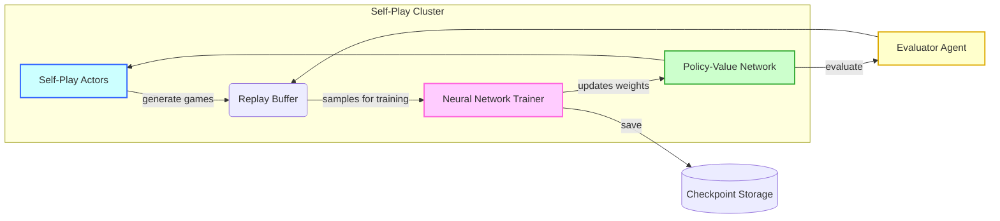
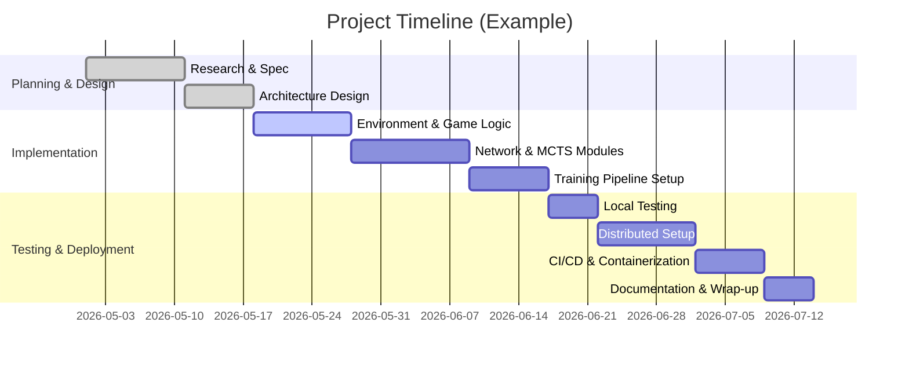

# AlphaZero‐Style Gomoku Project Plan

## Executive Summary  
This report outlines a complete technical roadmap for building an AlphaZero‐style Gomoku (五子棋) AI from scratch. We begin with a prioritized skills/tools list (languages, ML frameworks, RL libraries, distributed training, etc.), then propose a **Karpathy‐style Markdown wiki** structure for documenting context (rules, state representation, neural network architecture, etc.). Next, we detail **SAFe‐style Agile artifacts** (Epics, Features, User Stories, Acceptance Criteria, PI planning, Definition of Done) and map them to repository files. We then give step-by-step setup instructions for initializing the repo and adding documentation/code templates. A comprehensive **technical design** section covers state/action encoding, neural network design (e.g. ResNet policy‐value heads), MCTS integration (PUCT, cpuct formula), loss functions, self-play pipeline, replay buffer, evaluation and checkpointing, with example hyperparameters (e.g. MCTS sims≈400–2000, cpuct≈1.0–4.0【36†L307-L313】). We outline a **scaling roadmap** from local tests (single‐machine GPU) to multi‐GPU or cloud deployments, discussing hardware (GPUs vs TPUs), distributed training options (data‑parallel vs self‑play parallelism, Ray/RLlib), and approximate costs. We provide ready‐to‐run **research prompts** for each project phase, plus **comparison tables** (frameworks, hardware, deployment).  Mermaid diagrams illustrate the system architecture and a tentative project timeline.  Throughout, we cite primary AlphaZero resources (DeepMind papers, detailed tutorials, code repos) and authoritative agile/CI/CD sources. 

The following sections present this plan in detail.

## 1. Technical Skills & Tools (Prioritized)

- **Programming Languages:** Python is essential (dominant ML/RL ecosystem). C++/CUDA knowledge can help for high-performance code but is secondary. Familiarity with shell scripting and Dockerfile syntax is also useful.  
- **ML Frameworks:** PyTorch (preferred for research due to flexibility) or TensorFlow. PyTorch’s dynamic graph and library support (TorchVision, etc.) make it ideal.  Understanding of NumPy for general array work is assumed. JAX could be used for research on TPU (but here PyTorch is primary).  
- **RL Libraries & Environments:** Experience with OpenAI Gym-style environments (or [Gymnasium](https://gymnasium.farama.org/)【31†L109-L117】) will speed environment implementation.  Familiarity with libraries like Stable-Baselines3 (SB3) or [RLlib (Ray)](https://docs.ray.io/) is beneficial: SB3 offers standard RL algos for reference, while **Ray/RLlib** is designed for scalable RL training across machines【32†L15-L23】.  For game-specific tooling, [OpenSpiel](https://github.com/deepmind/open_spiel) by DeepMind supports board games (though custom Gomoku env may be simpler).  
- **MCTS & Self-Play:** In-depth understanding of Monte Carlo Tree Search (UCT/PUCT algorithms) is mandatory.  Implementing PUCT (AlphaZero’s variant combining Q and a prior) requires grasp of the PUCT formula: 
  > $$U(s,a)=Q(s,a)+c_{puct}\,P(s,a)\,\frac{\sqrt{\sum_b N(s,b)}}{1+N(s,a)}$$  
  where $c_{puct}$ is an exploration constant【26†L76-L84】.  Knowledge of self-play pipelines (generating games via MCTS and using results for training) is needed.  
- **Reinforcement Learning Fundamentals:** Must know policy/value networks, value iteration, policy iteration, and how self-play generates training targets ($\pi$ from visit counts, $z$ from game outcome)【26†L29-L37】【26†L41-L49】.  Experience with off-policy data buffers (replay memory) is useful (but AlphaZero uses tabular-like replay of complete games, as AlphaZero-style implements uniform sampling from recent games).  
- **Data Handling / Pipelines:** Skills to manage game data: e.g. efficient storage of self-play games (maybe using binary format or HDF5), batching data for training.  Knowledge of logging frameworks (Weights & Biases, TensorBoard) for metrics tracking.  Experience with experiment tracking (MLflow, Comet, W&B) helps reproducibility. RL frameworks often include utilities for replay buffers and training loops【47†L1-L4】.  
- **CI/CD & DevOps:** Experience with continuous integration (e.g. GitHub Actions, GitLab CI, Jenkins) to automate testing. Containerization (Docker) is important for reproducible environments. Familiarity with version control (git), code reviews, and ML-specific CI (e.g. linting Python, unit tests for env logic). Monitoring tools (e.g. Prometheus, Grafana) and ML logging (TensorBoard/W&B) are useful for live training metrics.  
- **Hardware & Distributed Computing:** Knowledge of GPU/TPU hardware, multi-GPU setups (NVIDIA NVLink, NCCL for PyTorch), and cloud platforms (AWS, GCP, Azure). Understanding of distributed training frameworks (e.g. PyTorch DDP, Ray’s actors for parallel self-play, Horovod, or TorchElastic) is required for scaling.  Familiarity with cluster management (Kubernetes, SLURM) is a plus. Estimating cost/compute needs (FLOPs, GPU-hours) based on similar projects is needed.  

_Key References:_ RL frameworks provide many utilities (e.g. “experience replay buffers… and training loops are provided as reusable components”【47†L1-L4】).  Ray/RLlib is explicitly designed for scalable RL across multiple machines【32†L15-L23】.  

## 2. Project Wiki Structure (Karpathy-Style)

We recommend a `docs/` or `wiki/` folder containing Markdown files that document the **project’s context**. Each key concept (game rules, data formats, model design, etc.) gets its own Markdown page. Suggested structure:

```
/docs
  /Rules.md
  /StateRepresentation.md
  /NetworkArchitecture.md
  /TrainingHyperparameters.md
  /Datasets.md
  /Experiments.md
  /EvaluationMetrics.md
  /Checkpoints.md
  /Reproducibility.md
  README.md            (overview with links)
```

Each file should follow Karpathy’s wiki style: clear headings, concise explanations, and bullet lists for lists. **Example file templates:**  

- **Rules.md** – Describes Gomoku rules (board size, win condition, players, e.g. Free-style Gomoku, Komi rules if any). Use diagrams or small examples. For instance:  
  ```markdown
  # Gomoku Rules
  - **Board:** 15×15 grid.
  - **Moves:** Black always plays first; players alternate placing one stone of their color on an empty intersection.
  - **Win:** 5 in a row (vertical, horizontal, diagonal) wins immediately. (Standard Gomoku allows overlines for Black, etc.)
  - **Restrictions:** (Note rules like no “double-four” for Black if using Renju variant, else pure free-style.)
  - **Edge cases:** e.g. board fills with no 5-in-row = draw.
  ```
- **StateRepresentation.md** – Defines how to encode game state as network input (e.g. binary planes for black/white stones, move history planes). Example snippet:  
  ```markdown
  # State Representation
  - Represent board as a 15×15×C tensor:
    - **Channel 0:** Current player stones (1 if current player's stone, 0 otherwise).
    - **Channel 1:** Opponent stones.
    - **Optional:** History channels (prior K moves) or a “to-move” constant plane.
  - Legal moves mask computed at runtime.
  - Flatten or index mapping for output (policy head outputs probability for each intersection plus “pass”).
  ```
- **NetworkArchitecture.md** – Outlines NN design. E.g. “Deep residual CNN with policy and value heads” referencing AlphaGo Zero.【19†L253-L262】【19†L263-L270】 Example:  
  ```markdown
  # Network Architecture
  - **Input:** 15×15×(C) tensor of board state (see StateRepresentation).
  - **Body:** Residual Convolutional Blocks (e.g. 10–20 ResNet blocks, 128–256 filters each).  
    - Each block: Conv(3×3), BatchNorm, ReLU, skip connection.
  - **Policy head:** 1×1 conv layer, output size = 15×15+1 logits (one per board point + pass). Softmax to probabilities.
  - **Value head:** 1×1 conv, flatten, followed by a small MLP (e.g. FC-ReLU-FC) to a single scalar in (-1,+1).  
  - This mirrors AlphaGo Zero’s design (17×19×19 input, 20–40 blocks)【19†L253-L262】【19†L263-L270】.
  ```
- **TrainingHyperparameters.md** – List training settings and rationale: MCTS sims per move, cpuct, learning rate schedule, batch size, replay buffer size, etc. Example:  
  ```markdown
  # Training Hyperparameters
  - **Self-play games per iteration:** e.g. 100 games.
  - **MCTS sims per move:** 800 (range 400–2000 in practice)【36†L307-L313】.
  - **cpuct (exploration const):** 1.0–4.0 (we use 1.0)【36†L307-L313】.
  - **Replay buffer size:** 100k positions (e.g. maxlen 200k)【36†L307-L313】.
  - **Batch size:** 256.
  - **Learning rate:** 1e-3 initial (Cosine or 1Cycle schedule between 1e-4 and 1e-2)【36†L307-L313】.
  - **Regularization:** L2 weight decay ~1e-4.
  - **Dirichlet noise (for exploration):** add 0.03 on root policy (Dir(0.03) for first 2 moves).
  ```
- **Datasets.md** – Describe any external data: e.g. “None used; we rely solely on self-play.” Or if using any human Gomoku SGF data for evaluation, list source.  
- **Experiments.md** – Track experiment plans: which architectures/hyperparameters to try, how to log results (W&B/CSV). Each experiment gets an ID.  
- **EvaluationMetrics.md** – Define how to evaluate (Elo rating, head-to-head against baseline, win-rate over random/baseline agents). For example, “measure winning percentage vs. MCTS-only player or vs. previous checkpoint; compute Elo” etc.  
- **Checkpoints.md** – Describe checkpoint format (e.g. PyTorch `.pt` files), where saved, and how to name them (`ckpt_iter_<i>.pth`).  
- **Reproducibility.md** – Notes on random seeds, environment versioning, and how to exactly reproduce results (seed lists, Docker image hashes, training logs).  

Each page should link to related ones (e.g. NetworkArchitecture links back to StateRepresentation). The top-level `README.md` in `docs/` can summarize contents and link to all sections.

## 3. SAFe-Style Agile Artifacts

We follow SAFe (Scaled Agile) conventions.  **Epics, Features, User Stories** are hierarchical:  
- **Epic**: a large objective (can span quarters) that is broken into Features. Examples: “EPI-001: Establish Project Infrastructure” or “EPI-002: Implement Gomoku Environment.” Epics map to top-level goals in the codebase (e.g. setting up CI, containers, initial project scaffolding). (Epics are “large bodies of work… broken down into smaller tasks”【42†L1708-L1711】 and typically 2–3 per quarter【42†L1727-L1730】.)  
- **Feature**: a deliverable piece of functionality (fits one PI/iteration). E.g. “FTR-101: Dockerize development environment,” “FTR-102: Create Gomoku game engine module (`game.py`),” “FTR-103: Build basic MCTS implementation.” Features group related user stories. They can be documented in a file like `docs/SAFe/Features.md`.  
- **User Story**: a specific requirement from the user (usually dev-as-user) perspective, e.g. “As a Developer, I want a Gym-compatible Gomoku environment so I can integrate with RL training.” Acceptance Criteria follow “Given/When/Then” format.  Example story in `docs/SAFe/UserStories.md`:  

  ```
  - **User Story US-201:** *Implement Gomoku environment*  
    - **As a** ML researcher,  
    - **I want** a Gomoku game engine that follows OpenAI Gym API,  
    - **So that** training agents can self-play without manual intervention.  
    - **Acceptance Criteria:**  
       - Can reset to an empty board state (black to move by default).  
       - `step(action)` returns (next_state, reward, done, info). Reward = +1 for win, -1 for loss, 0 otherwise.  
       - All terminal states correctly detected (5 in a row).  
       - Moves outside [0,14]×[0,14] are invalid.  
       - Unit tests cover move generation, win detection.  
  ```
  
- **Acceptance Criteria:** Clear, testable conditions. (Criteria above ensure the story is done.)  
- **Program Increment (PI) Planning:** SAFe uses timeboxes of ~8–12 weeks【46†L1-L4】. We adopt 4-week sprints (~3 sprints per PI) or 2-week sprints (~5 per PI). At each PI planning event, features are assigned to sprints. For example, PI-1 might cover initial setup (Epic EPI-001), PI-2 implement core training loop, etc. A **cadence** example: two-week sprints with a planning meeting every sprint, and PI planning every 10 weeks.  
- **Definition of Done (DoD):** For this project, DoD could be: code is merged to main after peer review, passes all tests, documentation is updated, training runs reproducibly with baseline hyperparameters, and performance meets the acceptance (e.g. evaluates at least X% win-rate vs random).  

We can map these artifacts to repo files. For example:
- `docs/SAFe/Epics.md` lists Epics (ID, title, description).  
- `docs/SAFe/Features.md` lists Features (ID, description, epic link).  
- `docs/SAFe/UserStories.md` as above.  
- `docs/SAFe/PI_Planning.md` describes the PI cadence (e.g. 10-week PI with inspection).  
- `docs/SAFe/DefinitionOfDone.md` states criteria.  

These could also be maintained as issues in a tracker (e.g. GitHub Issues/Jira) but keeping them in docs ensures visibility.

## 4. Project Setup Steps (from Empty Repo)

**Step 1: Initialize Repo & Basic Files.**  Create a new Git repository. At minimum add:
- `README.md` (project overview)
- `LICENSE` (e.g. MIT)
- `.gitignore` (ignore env, datasets, checkpoints)
- `requirements.txt` or `environment.yaml` (initial dependencies)
- `Dockerfile` (base image with Python 3.x, GPU support, install libs)
- GitHub Actions config (`.github/workflows/ci.yml`) for CI.  

Example `README.md` top snippet:
```markdown
# AlphaZero-Gomoku
Implementing an AlphaZero-style agent for Gomoku (Five-in-a-Row).  
- **Language:** Python  
- **Frameworks:** PyTorch (DL), OpenAI Gym (env), Ray RLlib (distributed)  
- **Algorithm:** Self-play MCTS + Policy-Value NN (AlphaGo Zero)  
```

**Step 2: Create Documentation Structure.**  
In the repo, add a `docs/` directory (or set up a GitHub Wiki). Under `docs/`, create subfolders or markdown files per section from Part 2. For example: `docs/Rules.md`, `docs/StateRepresentation.md`, etc., each with headers and initial content. Use the templates above.

**Step 3: Set Up Code Scaffold.**  
Add a `src/` or `envs/` directory for code. For example:
```
/src
  game.py       # Gomoku rules and state logic
  mcts.py       # MCTS implementation
  network.py    # Neural network (PyTorch model)
  train.py      # Training loop (self-play, NN update)
  evaluate.py   # Evaluation scripts (play against baseline)
  utils.py      # Helper functions (e.g. board rotations for augmentation)
```
Populate each with minimal structure:
- In `game.py`, define a `GomokuEnv` class (with reset, step, render). Include docstrings.  
- In `network.py`, define a PyTorch `AlphaZeroNet` class (subclass of `nn.Module`). Include placeholders for conv layers and heads.  
- In `mcts.py`, outline an `MCTSNode` and `MCTS` class with method stubs.  

Example `game.py` snippet:
```python
class Gomoku:
    def __init__(self, board_size=15):
        self.size = board_size
        self.reset()
    def reset(self):
        self.board = [[0]*self.size for _ in range(self.size)]
        self.player = 1  # 1=Black, -1=White
        return self._get_state()
    def step(self, action):
        # action is (row,col); place stone, check win
        pass  # implement move logic
```

**Step 4: Configure CI/CD and Containers.**  
- Write `Dockerfile`: use `FROM pytorch/pytorch:latest` or similar CUDA-enabled image. Install Gym, numpy, etc.
- Configure GitHub Actions for linting and running a basic unit test suite. For example, `.github/workflows/test.yml` to run `pytest` on commit.  
- Optionally, set up a `docker-compose.yml` if needed for multi-container (e.g. one for training server, one for logging).  

**Step 5: Initialize Experiment Tracking.**  
Integrate Weights & Biases or TensorBoard. For example, in `train.py` add hooks to log loss/accuracy curves. Include a sample config or `wandb.init(project="gomoku-alphazero")`.  

**Step 6: Example Config and Naming Conventions.**  
Use clear naming:
- Config files: `config/default.yaml` for hyperparameters.
- Checkpoints: `checkpoints/model_epoch_{epoch}.pt`.
- Data: `data/selfplay_iter_{i}.pkl`.  

Include example snippet in documentation, e.g. in `TrainingHyperparameters.md`:
```markdown
Example config (`config.yaml`):
```yaml
board_size: 15
num_mcts_sims: 800
cpuct: 1.0
batch_size: 256
lr: 0.001
buffer_size: 100000
```
```
Show how config parameters map to code.  

At each step, commit with a clear message (e.g. “Initialize project structure and docs, add CI”). Document progress in SAFe Wiki (e.g. mark Feature FTR-100 implemented).

## 5. AlphaZero for Gomoku – Technical Design

**State & Action Encoding:**  
- **State:** Use a 15×15×C tensor. For simplicity: 2 planes (current player's stones, opponent stones). Optionally include a plane of all 1s to indicate current player (like AlphaGo Zero’s “black to move” plane)【19†L253-L262】. If using move history, include additional planes (e.g. last N moves of each color).  
- **Actions:** Gomoku moves are board positions; action space size = 15×15 = 225 (no “pass” in standard Gomoku). Index actions by flattening (row*15+col). Illegal moves will be masked (policy output at those positions ignored).  

**Neural Network Architecture:**  
- **Body:** A deep **ResNet** like AlphaGo Zero’s. For example, 10–20 residual blocks (each block: Conv3×3, BatchNorm, ReLU → Conv3×3, add skip). Filter count 128 or 256. (AlphaGo Zero used 20–40 blocks with 256 filters【19†L253-L262】.)  
- **Policy Head:** 1×1 Conv layer reducing filters to e.g. 2, followed by BatchNorm/ReLU, then a final linear layer to 225 logits. Apply softmax over board positions.  
- **Value Head:** 1×1 Conv (reduce to 1 filter), flatten, then a small MLP (e.g. 1 hidden layer of 128 units + ReLU) to scalar output. Apply tanh to bound to (-1,+1).  
- This dual-head design is fundamental to AlphaZero: one network outputs both $\pi(a|s)$ and $v(s)$【19†L253-L262】【19†L263-L270】.  

**Loss Function:**  
At training time, use the combined loss for a batch of (state $s_t$, target policy $\pi_t$, outcome $z_t$) pairs from self-play:  
$$\mathcal{L} = \sum_t \left[(v(s_t) - z_t)^2 \;-\; \pi_t^\top \log p(s_t)\right]$$  
where $v(s_t)$ is the network value, $p(s_t)$ the network’s policy logits, $z_t\in\{-1,+1\}$ is game outcome【26†L41-L49】. (This is MSE for value plus cross-entropy for policy.)  

**MCTS Integration (Self-Play):**  
- **Search:** For each move during self-play, run a full MCTS from the root position using the *PUCT* formula【26†L76-L84】. On each simulation:  
  1. **Selection:** From the root, recursively select action $a$ that maximizes $Q(s,a)+U(s,a)$ (where $U$ uses $c_{puct}$, prior probability $P(s,a)$, and visit counts)【26†L76-L84】.  
  2. **Expansion/Evaluation:** When a leaf node is reached, expand it: use the neural network to compute prior probabilities $P(s',\cdot)$ and value $v(s')$. Initialize new tree edges with $N=Q=0$ and store $P$.  
  3. **Backpropagation:** Propagate the value $v$ (or actual ±1 if terminal) up the tree, updating $W(s,a)$ and $N(s,a)$ for each edge traversed【24†L176-L183】.  
- **Root Policy:** After $N$ simulations (e.g. 800–2000 per move)【36†L307-L313】, compute a move probability distribution $\pi(a|s)$ by normalizing visit counts $N(a)$【26†L92-L99】. During training self-play, sample moves from $\pi$ (with temperature τ=1 in early moves, τ→0 later)【24†L133-L142】【24†L180-L184】. This produces varied play.  
- **Data Storage:** Record $(s_t, \pi_t, z)$ for each position in the self-play game (where $\pi_t$ is the visit-count policy, $z$ is eventual game outcome for the player at $s_t$). These samples go into a replay buffer.  

**Training Loop:**  
1. **Self-Play:** Generate a batch of games (e.g. 100 per iteration) by self-play with the current network. Collect training samples as above.  
2. **Replay Buffer:** Maintain a circular buffer of the most recent games (e.g. last 1000 games, size ~200k positions【36†L307-L313】).  
3. **Network Update:** Sample mini-batches from the buffer (uniformly) to train the network using the loss above. Run for several epochs per iteration.  
4. **Iteration:** After training, optionally evaluate the new network against the old one (Arena evaluation). If the new model outperforms (or periodically), continue; otherwise possibly revert. Checkpoint models (e.g. save weights every iteration).  
5. **Hyperparameters:** Based on [36], good defaults might be: MCTS sims ~400–800, cpuct=1.0【36†L307-L313】, buffer size 100k–200k, learning rate ~1e-3 (with 1cycle to 1e-2), batch size ~256. These can be tuned.  

**Evaluation & Checkpointing:**  
- Periodically play the current model against a fixed baseline (random or previous checkpoint) to gauge improvement. Compute win rates and Elo.  
- Save checkpoints in `checkpoints/`. Keep a metadata file mapping checkpoint IDs to training iteration and performance.  
- Record metrics: training loss, policy/value accuracy, ELO, and hardware utilization (GPU memory).  

## 6. Testing & Scaling Roadmap

**Local Development (Laptop/Desktop):**  
- **Hardware:** Initially, use CPU or a single GPU (e.g. NVIDIA RTX 3060/3080) for testing correctness and small-scale experiments. Training fully to convergence will be slow, but sufficient to debug.  
- **Parallelism:** Even on one machine, use multi-processing: e.g. spawn multiple self-play actors (each running MCTS games in parallel) to feed data to the learner. Python’s `multiprocessing` or Ray on local mode can help.  

**Rented Server / Multi-GPU:**  
- **Hardware Options:** Renting cloud GPUs (e.g. AWS p3.2xlarge with one V100, g4dn.xlarge with T4, or p4 instances with A100) or TPUs (via Google Cloud). TPU usage requires JAX/TensorFlow; PyTorch on GPU is standard. An A100 (~$40k hardware, ~$3/hr on cloud) vastly outperforms consumer GPUs【19†L275-L283】.  
- **Scaling Strategy:** Two axes of parallelism:  
  - *Self-Play Parallelism:* Run many independent actors to generate games. For example, 100 actors each producing games concurrently. Ray/RLlib or custom Ray actors can distribute these across GPUs/CPUs.  
  - *Data-Parallel Training:* Use PyTorch’s DistributedDataParallel to train across multiple GPUs (e.g. 4–8 GPUs on one server) to speed network updates. This requires synchronizing gradients over NCCL. Alternatively, Horovod can be used.  
- **Cluster/Distributed Training:** For large scale, set up a cluster (multiple machines). Ray can orchestrate both actor and learner on a cluster. RLlib example: it can auto-manage rollout workers. The former DeepMind setup used 64 GPUs and 19 parameter servers【19†L275-L283】 (though that was TPU era). For our scale, even 2–4 high-end GPUs can be effective.  
- **Data vs. Model Parallelism:** Gomoku net is modest size, so model parallelism is rarely needed. Focus on data parallel (multiple batches across GPUs).  
- **Cost Estimates:** If a single iteration of self-play + training on an RTX3090 (24GB) takes ~4 hours (as in [8]), then using 8×3090s could reduce this to ~0.5h. Cloud GPU pricing: e.g. NVIDIA T4 ~ $0.50/hr, V100 ~$2/hr, A100 ~$3/hr. Keep instances for training only (stop idle to save cost).  
- **Deployment:** Use Docker containers for environment consistency on server. Automate with shell scripts or tools like [KubeFlow](https://www.kubeflow.org/) for orchestrating experiments, or simply use AWS Batch/EC2 with Terraform.  
- **Monitoring:** Stream training logs to TensorBoard (hosted or via local tunnel) or W&B dashboard. Monitor GPU utilization to ensure jobs aren’t bottlenecked.  

## 7. Deep-Research Prompt Templates

Below are example research/analysis prompts (for an LLM or search) for each project phase. Use them to dig deeper when needed:

- **Research Phase Prompts (Understanding & Design):**  
  - “Explain how AlphaZero encodes game states and actions; how to apply that to Gomoku.”  
  - “Search papers on Reinforcement Learning for Gomoku or similar (5-in-row).”  
  - “Find comparisons of ResNet architectures (depth, filters) for board games.”  
  - “How is Monte Carlo Tree Search integrated with neural networks (PUCT formula)?”【26†L76-L84】  
  - “Examples of loss functions in AlphaZero: policy-value combined loss.”【26†L41-L49】  

- **Implementation Phase Prompts:**  
  - “Write Python code to generate all legal moves for a Gomoku board state.”  
  - “Implement PUCT-based MCTS selection step in code.”  
  - “Configure PyTorch DDP for multi-GPU training of a policy-value network.”  
  - “Sample script to log training loss and accuracy to Weights & Biases.”  
  - “Example Dockerfile for a PyTorch CUDA development environment.”  

- **Debugging Phase Prompts:**  
  - “Common bugs in implementing self-play MCTS agents and how to test them.”  
  - “How to debug vanishing gradients in a ResNet training loop.”  
  - “Visualizing MCTS search tree statistics (visit counts, Q values) for correctness.”  
  - “How to verify that the Gomoku environment and reward are implemented correctly.”  

- **Optimization Phase Prompts:**  
  - “Strategies to speed up MCTS: parallelization, caching network inferences.”  
  - “Hyperparameter tuning for AlphaZero: cpuct, learning rate schedule, batch size.”  
  - “Distributed training with Ray RLlib: example config for self-play algorithm.”  
  - “Profiling GPU usage in PyTorch training.”  

- **Deployment Phase Prompts:**  
  - “Setting up a CI/CD pipeline for machine learning projects (Linting, tests, training jobs).”  
  - “Deploying PyTorch models as a service (TorchServe, Flask API for Gomoku play).”  
  - “Monitoring long-running ML jobs on AWS EC2 with CloudWatch.”  

Each prompt is designed to get in-depth guidance or code examples relevant to the phase. Adjust wording to your needs.

## 8. Comparative Tables

### 8.1 Frameworks and Libraries

| Tool / Library       | Type                   | Strengths / Use Case                       | Notes / Considerations                    |
|----------------------|------------------------|--------------------------------------------|-------------------------------------------|
| **PyTorch**          | DL Framework           | Dynamic graph, strong community, GPU support | Good for custom models (use for NN)       |
| **TensorFlow/Keras** | DL Framework           | Wide adoption, TPU support                 | More boilerplate for custom ops           |
| **JAX**              | DL Framework           | XLA compilation (TPU friendly), functional | Can be harder to debug, fewer RL examples |
| **OpenAI Gym**       | Env API                | Standard RL environment interface          | Use for structuring `GomokuEnv`           |
| **Stable Baselines3**| RL Algorithms Library  | Easy access to standard RL algos           | Not directly for AlphaZero (no MCTS)     |
| **Ray RLlib**        | RL Platform            | Built for distributed RL, multi-agent      | Good for scaling self-play across nodes【32†L15-L23】 |
| **OpenSpiel**        | Board Games Library    | Games implementations & RL tools           | May have Gomoku support; integrates with AlphaZero concepts |
| **Custom MCTS Code** | Algorithm (custom)     | Tailored PUCT for Gomoku                   | Need to implement or adapt from examples  |

### 8.2 Hardware Options

| Hardware           | Type          | Compute Characteristics      | Cost (approx.)      | Deployment Notes                    |
|--------------------|---------------|------------------------------|---------------------|-------------------------------------|
| **CPU (x86)**      | Local/Cloud   | Good for light testing       | Low (free–few¢/hr)  | Useful for debugging; too slow for training |
| **NVIDIA RTX 3090**| GPU (on-prem) | 36 TFLOP FP32, 24GB memory   | $\sim$1500–2000 USD | Powerful for local/prototype training |
| **NVIDIA A100**    | GPU (cloud)   | 312 TFLOP FP32, 80GB memory  | $\sim$3/hr (cloud)  | Excellent for large-scale training【19†L275-L283】 |
| **NVIDIA 4090**    | GPU (on-prem) | 83 TFLOP FP32, 24GB memory   | $\sim$2000 USD      | Consumer-level, high perf            |
| **Google TPU (v2/v3)**| TPU (cloud) | 45–125 TFLOP (bfloat16)     | $\sim$8/hr          | Requires JAX/TF, great at scale     |
| **Multi-GPU Clusters** | GPU (cloud) | Many A100s/RTX GPUs         | Varies ($10–100+/hr)| Use Ray/SLURM; complex setup        |

### 8.3 Deployment Strategies

| Strategy                   | Description                             | Pros                                      | Cons                          |
|----------------------------|-----------------------------------------|-------------------------------------------|-------------------------------|
| **Single Machine (local)**  | Develop and test on one server/GPU      | Simple setup, low latency testing         | Limited scale, lower throughput |
| **Multi-GPU (same host)**   | Use multiple GPUs (DataParallel/DDP)    | Faster training with synced updates       | Host GPU memory limits         |
| **Multi-Node (cluster)**    | Distribute actors and learner across nodes | Scales almost arbitrarily, fault tolerance | Complex orchestration needed   |
| **Cloud (AWS/GCP/Azure)**   | Rent GPU instances on demand            | Flexible scaling, pay-as-you-go           | Can be costly; need infra mgmt |
| **Container/Kubernetes**    | Dockerize, use K8s for orchestration    | Reproducible, portable, auto-scaling      | Setup complexity, requires K8s knowledge |
| **Serverless / Batch**      | Managed services (AWS Batch, etc.)      | Simplified compute usage, auto-provision  | Less control, latency overhead |

## 9. System Architecture & Timeline Diagrams

Below is a high-level system architecture (Mermaid flowchart) and a Gantt chart for an example project timeline.



**Figure:** System architecture: *Self-Play Actors* run MCTS to generate game data (stored in a *Replay Buffer*). The *Trainer* samples this buffer to update the *Policy-Value Network*. The updated network is saved as checkpoints. An *Evaluator* can play the current network against baselines or previous versions to track performance.



**Figure:** Tentative project schedule. Phases include initial research, coding (environment, network, MCTS, training loop), followed by testing (unit/integration) and scaling (multi-GPU/cloud setup), then CI/CD and final documentation. Adjust timelines as needed per team size.

## 10. References & Further Reading

**Primary Sources (AlphaZero & RL):**  
- **Silver et al., 2017 (Nature):** *“Mastering the game of Go without human knowledge”* – AlphaGo Zero paper (foundation of AlphaZero)【19†L253-L262】【19†L263-L270】.  
- **Silver et al., 2018 (arXiv):** *“Mastering Chess and Shogi by Self-Play…”* – AlphaZero generalization.  
- **Surag Nair’s AlphaGo Zero Tutorial:** “A Simple Alpha(Go) Zero Tutorial” (detailed walk-through of AlphaZero algorithm and code)【26†L29-L37】【26†L41-L49】.  
- **Jonathan Hui (Medium):** “MCTS in AlphaGo Zero” – clear explanation of PUCT and search steps【24†L167-L175】【24†L229-L234】.  
- **ChessProgramming Wiki (AlphaZero):** Overview of network heads and inputs (cites AlphaGo Zero facts)【17†L182-L189】.  
- **AlphaZero Open-Source Repos:** e.g. *suragnair/alpha-zero-general* (PyTorch example code), *michaelnny/alpha_zero* (AlphaZero in PyTorch including Gomoku)【2†L281-L289】【36†L307-L313】.  
- **OpenAI & DeepMind Blogs:** e.g. DeepMind AlphaZero blog; OpenAI posts on self-play (Dota 5) for multi-agent RL insights.  

**Tools & Frameworks:**  
- **Ray RLlib Documentation:** (2024) Official docs for RLlib distributed RL.  
- **OpenAI Gym Documentation:** For environment API.  
- **Stable Baselines3 Docs:** Examples of RL training loops (though off-policy).  
- **Weights & Biases MLOps:** CI/CD and experiment tracking guides.  

**Agile/DevOps:**  
- **Atlassian Agile Coach:** *Epics, Stories, Initiatives* (definitions and examples)【42†L1708-L1711】【42†L1727-L1730】.  
- **SAFe Framework:** Scaled Agile official site or ServiceNow guide – PI planning (PI = 8–12 weeks)【46†L1-L4】.  
- **MLOps Resources:** e.g. articles on CI/CD for ML (MachineLearningMastery, W&B blog).  

**Recommended Links:**  
- [AlphaGo Zero Paper (Nature)](https://www.nature.com/articles/nature24270) (Silver et al. 2017)  
- [AlphaZero Paper (arXiv)](https://arxiv.org/abs/1712.01815) (Silver et al. 2018)  
- [AlphaZero GitHub (suragnair)](https://github.com/suragnair/alpha-zero-general) – general implementation and tutorial.  
- [OpenAI Gym](https://gym.openai.com/) – environment API.  
- [Ray RLlib Docs](https://docs.ray.io/en/latest/rllib.html) – scaling RL.  
- [Weights & Biases CI/CD](https://wandb.ai/site#enterprise) – MLOps best practices.  
- [SAFe Program Increment](https://www.servicenow.com/docs/r/yokohama/it-business-management/scaled-agile-framework-safe/create-SAFeprogramincrement.html) – PI length guidelines【46†L1-L4】.  
- [Stanford CS760 Lecture (CRaven)](https://www.biostat.wisc.edu/~craven/cs760/lectures/AlphaZero.pdf) – slides on AlphaZero architectures and training.  
- [MCTS Tutorial (Jonathan Hui)](https://jonathan-hui.medium.com/monte-carlo-tree-search-mcts-in-alphago-zero-8a403588276a) – medium article (PUCT, search steps)【24†L167-L175】【24†L229-L234】.  

These resources cover theory, implementations, and best practices. In particular, the AlphaGo/AlphaZero papers and Surag Nair’s tutorial are foundational for understanding the deep learning and MCTS integration.

